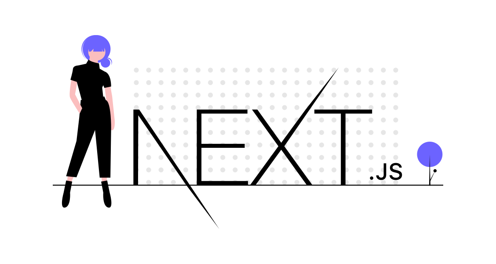

# SPA, SSR (왜 Next.js를 사용하는가?)

## 들어가며

언젠간 글을 꼭 써야지 했던 내용입니다.
면접에서 SPA, SSR의 용어를 설명하라고 했는데, 제대로 대답을 못해서 부끄러웠던 기억이 납니다. 그 이후 이곳저곳 찾아봤지만, 이제 막 개발을 시작하거나 개발을 모르지만 관심있는 사람을 위한 글은 별로 없어서 아쉬웠던 기억이 있네요.
그리고 회사에서 Next.js를 사용하는데, 그걸 왜 쓰냐는 대답을 하기 위해선 SPA, SSR 에 대한 설명이 필요한거 같아서 뒤에 살짝 붙여봤어요.
_(예시가 좀 조악하거나 틀릴수도 있지만, 그래도 한번 써봅니다. 혹시 틀린 부분이 있다면 댓글로 말씀주세요. 좀더 공부해서 수정하겠습니다.)_

## SPA(Single-page application, 단일 페이지 애플리케이션)

일단, 용어를 알기 위해서는 기본적인 설명부터 봐야겠죠? SPA를 위키백과에서 잠시 살펴보겠습니다.

> A single-page application (SPA) is a web application or website that interacts with the web browser by dynamically rewriting the current web page with new data from the web server, instead of the default method of the browser loading entire new pages. The goal is faster transitions that make the website feel more like a native app.
> 출처: [Single-page application | Wikipedia](https://en.wikipedia.org/wiki/Single-page_application)

정의에 따르면, 웹사이트를 에서 행동(ex. 클릭)을 했을때 전체 페이지가 로딩되는 대신 현재 웹페이지에서 동적으로 데이터만 바뀌게 되는 것을 SPA 라고 합니다.

여기까지 읽으면 뭔가 매우 어려운 개념인거 같죠? 그래서 좀 쉽게 풀어보겠습니다. 한번 상상을 해보죠. 만약 인스타에서 어떤 사진에 좋아요를 눌렀는데, 갑자기 내가 보던 모든 게시물이 전체 로딩이 다시 된다면? (페이지가 갑자기 하얘지더니 사진들이 하나씩 차례로 다시 보이기 시작하는 그런 상황이겠죠?)

아마 끔찍하겠죠. 이걸 좀 더 확장해서 생각해보시면 됩니다. 더보기 버튼 하나 눌렀는데, 또는 다른 사진을 보기 위해 옆으로 넘겼는데, 게시물이 전체 다시 로딩이 된다면? 사람들은 그 사이트 안쓰려고 할꺼에요.

위 예시를 보면 아시겠지만, SPA 는 현재 우리가 사용하는 거의 모든 웹페이지에서 이미 (부분적으로) 들어가 있는 기능입니다. 특히, 좋아요 싫어요 버튼이 있으면 거의 SPA 개념을 이용한 것이라고 보면 되죠.

인스타나 페이스북을 보면, 내가 새로운 피드를 보려면 스크롤을 내리기만 하면 되죠? 그게 다 SPA 인 겁니다. 모양은 이미 정해져 있고, 사진이나 글 같은 데이터만 내려주면 되니까 개발 측면에서도 데이터 비용을 아낄 수 있다는 장점이 생기는 거죠.

그럼 반대로 단점도 생기겠죠? 단점은 초기 페이지가 만들어 질 때까지의 시간이 오래 걸린다는 거에요. 모양이 정해져 있기 때문에 모양에 관련된 모든 데이터들(좋아요 버튼 모양, 사진 사이즈, 글꼴 등 모든게 데이터입니다.) 이 한번에 먼저 내려와서 자리를 잡고, 그 이후 바뀌는 정보들이 넘어오게 되다 보니 처음 접속시에는 속도가 느려질 수 밖에 없는거죠. (대신 그 이후에는 오히려 더 빠른 속도를 보입니다. 그래서 인스타 피드를 볼때 렉이 거의 없는것처럼 보이는거죠.)

이 단점이 정말 무서워지는 예를 들어볼께요. 이것도 예를 들어볼께요. 네이버를 생각해보면, 네이버에는 어마어마하게 많은 모양들이 있어요. 네이버 메인화면 모양, 뉴스기사 모양, 로그인 모양, 카페 모양, 이메일 모양 등등.. 정말 셀수 없이 많은 모양들이 있어요. 이런 모양들을 다 가져와서 처음 켤때 자리잡게 한다면, 그럼 네이버 한번 들어가면 20초씩 기다려야 쓸 수 있을껄요? 그렇게 느린 사이트면 사람들이 사이트 고장난줄 알고 다시는 들어가지 않을꺼에요. 즉, 웹사이트에 모양이 많아지면 많아질수록 CSR 을 사용하면 느려질 수밖에 없겠죠?

이런 단점을 극복하기 위해서 SSR 을 사용하게 됩니다.
_(물론, 이 말고도 다른 단점들도 있습니다만, 일단 여기서는 하나의 단점만 다루겠습니다.)_

## SSR(Server Side Rendering)

SSR 은 원래 있던 개념인데, 특별한 개념은 아니었어요. 당장 우리가 옛날에 사용했던 사이트들은 기본적으로 SSR 방식이었거든요. 이것도 예를 들어 설명할께요. 어떤 사이트에 게시판이 있다고 할께요. 게시판 게시물 목록에서 어떤 글을 클릭하면 그 글 내용으로 이동하죠? 그걸 예전에는 서버에서 클릭할 때마다 글 모양과 내용을 모두 한번에 넘겨줬어요. 그래서 옛날 웹사이트는 당연하게도 SSR 을 사용하고 있었던 거에요.

SPA 로 넘어오면서 로딩 속도에 문제가 생기니까, 사람들이 내놓은 방식은 이거였어요.
'옛날 게시판 만들던 방식처럼, 처음에는 먼저 모양이랑 데이터랑 한번에 넘겨서 먼저 화면 만들어 주고, 그 이후에 다른 모양들을 점점 가져다주면 되지 않을까?'
이렇게 되면 처음 화면도 빨리 뜨고, 나중엔 모양은 이미 조금씩 가져갔으니 필요한 데이터만 넘겨주면 되는 상황이 되는거죠.

결국 SSR 은 모양이 많은 웹사이트 일 수록 꼭 필요한 기능이 된 거에요.

## 그럼 Next.js는 뭐야?

웹사이트를 만들때 React 를 사용한다는 말은 많이 보셨을 거에요._(못보셨다면, React 를 직접 검색해보세요. 어마어마하게 많은 글들이 있습니다. 당장 velog 를 만드신 분이.. 책도 쓰신 그것이에요.)_
React는 웹 사이트를 SPA로 만드는 것을 매우 편하게 해주는 강점이 있는 기술이거든요. 그래서 사람들이 많이 쓰게 되고, 그에 따라 복잡한 모양의 사이트들도 React 를 고민하게 됬죠.

Next.js 는 React를 사용할 때, SSR 을 매우 편하게 해주는 도구에요.
SSR 을 직접 만드는 시간보다 Next.js 를 공부해서 사용하는게 더 낫다고 생각하니까, 요새는 많은 채용공고에서 React 를 쓰는 회사면 대다수가 Next.js 를 우대사항으로 집어넣고 있는거 같아요.

위에 SPA 와 SSR 을 설명하다보니 Next.js 에 이런 기능이 있다 라는 설명이 부족한거 같은데, 찾아보면 정말 편리한 기능들이 많이 있어요.

## 마무리

오늘은 SPA, SSR 에 대해 설명하고, Next.js를 사용하는 이유에 대해 적어봤습니다.
전문적인 글을 적으려다가, 방향을 바꿔서 가벼운 글을 작성해 봤는데, 조금이라도 도움이 될 수 있으면 좋겠습니다!

## 참고자료

- [SPA (Single Page Application) | 불곰님 블로그(Tistory)](https://brownbears.tistory.com/406)
- [Single Page Application & Routing | PoiemaWeb](https://poiemaweb.com/js-spa)
- [Next.js 제대로 알고 쓰자 | 문성진님 블로그(medium)](https://medium.com/@msj9121/next-js-%EC%A0%9C%EB%8C%80%EB%A1%9C-%EC%95%8C%EA%B3%A0-%EC%93%B0%EC%9E%90-8727f76614c9)
- [서버 사이드 렌더링 그리고 클라이언트 사이드 렌더링 | Jbee님 블로그(Tistory)](https://asfirstalways.tistory.com/244)
- [Next.js 공식 Tutorial | Nextjs.org](https://nextjs.org/learn/basics/getting-started)

- [무료 일러스트 모음 | undraw.co](https://undraw.co/illustrations)
