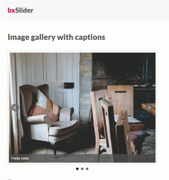

# 2020년 6,7월 돌아보기

점점 올해의 숙제처럼 느껴지는 회고 시리즈, 부지런히 숙제를 끝내기 위해서 6,7월 회고 시작합니다.

## 오타를 줄이는 법

회사에서 웹 페이지를 만들던 중, 버튼 클릭에 따라 이미지가 바뀌는 컴포넌트를 만들었습니다.

> 
> 이렇게 클릭을 하면 화면이 바뀌는 모양이었습니다. 회사에서 bxslider 를 사용중이길래 그대로 사용했어요.
> *출처: [bxSlider](https://bxslider.com/examples/image-slideshow-captions/)*

library 를 쓴것까진 좋았는데, 이상하게 동작을 하더라구요? 새로고침 할 때마다 

## 질문하는 방법

