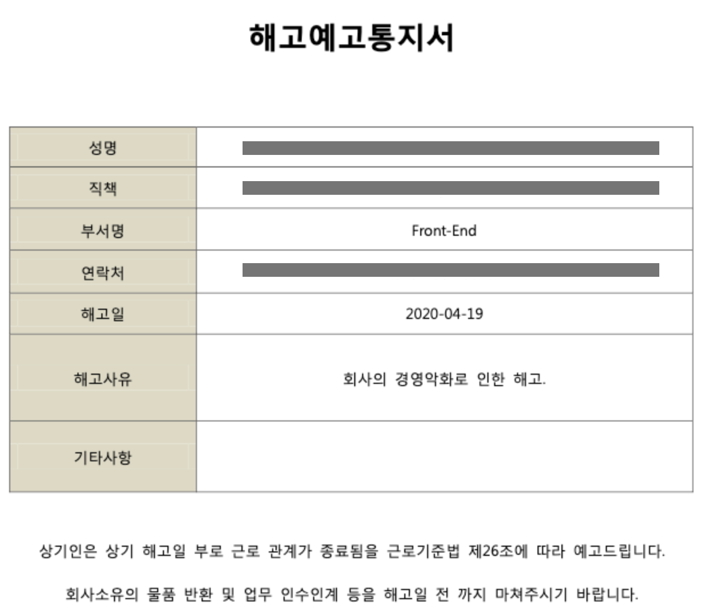

# 2020년 3월 돌아보기(코로나 시국 중 이직 경험기)

## 들어가기 전에

월간 회고 3번째 입니다.
원래 이 글의 개요를 잡은건 4월 7일이었는데, 제목과 관련된 일 + 글을 쓰다가 문득 찾아오는 그때의 기억들을 지워내느라 많이 늦어졌네요.
그래도 4월을 넘기기 전에 쓰려고 합니다!
결론을 먼저 말씀드리자면 **회사가 망했고, 그래서 이직했습니다.**
그래서 이번 글에서는 코로나 시국에서의 이직 후기와 겪은 일들을 이야기해보고자 합니다.

## 회사의 해고통보

3월 중순에 회사에서 CEO와 전 직원이 1:1면담을 하게 되었고, 거기서 80%가량의 직원들이 해고예고통보를 받게 되었습니다. 해고 예고 통보를 받은게 처음이라 당황스러웠지만, 한편으론 재밌는 경험이었습니다.(과연 내가 살아보면서 언제 이런걸 받아보겠어?! 이런 느낌이었어요.ㅋㅋㅋㅋㅋ)

_이게 제가 받은 그것이었습니다._

해고통보를 받기 전부터 회사가 무너진다고 느껴지는 몇가지 시그널이 있었겠죠? 제가 다닌 회사에서는 몇가지 포인트가 있었어요.

1. 회사가 제대로 된 매출구조를 가지기 전에 인원이 20명으로 증가함
2. 연봉협상을 처음 약속했던 날짜보다 미루거나, 적은 금액으로 계약하는 사람들이 생김
3. 대표의 식언이 잦아지고, 그 여파로 일에 혼선이 빚어짐

저는 위와 같은 문제점을 느끼고 이전부터 이직준비를 하고 있던 상황이었고, 덕분에 다른 해고통보를 받은 사람들보다 빠르게 이직을 할 수 있었습니다.
(이 글이 늦어지게 된건, 이직의 마지막 과정과 회고시점이 겹쳐지면서, 이직이 완료된 이후 회고를 쓰고 싶어서 늦어지게 됬죠.)

---

#### 덧붙임1 - 회사 상태 파악의 어려움

위에서는 무너진다고 느껴지는 시그널만 이야기했지만, 실제로는 회사가 성장하고 있다는 긍정적인 시그널도 있었어요.
회사가 목표로 삼은 주요 지표들이 많이 올라가서 목표치에 근접했었고, 다음 스텝을 위한 IR 이 진행되면서 그 과정이 어떤지 보고하는 등 우리가 잘 나가는구나 라는 느낌을 받기도 했지요.

이런저런 시그널들이 한번에 느껴지게 되면, 회사가 좋은 때인지 아닌지 구분하기 참 어렵더라구요. 면접을 진행하면서 이런 시그널들을 가지고 정형화 시키는게 가능할까 싶은 생각도 했었는데, 아직은 정형화 할 수 없는거 같아서 아쉬웠어요.
(망할만한 회사를 더 다녀보면 정형화시킬 수 있을까? 라고 생각했다가, 그냥 정형화시키지 않는게 더 좋겠다고 생각하게 되었습니다. 글을 읽는 여러분들도 망할만한 회사 만나지 않길 바라요!)

## 코로나 시국

저는 3월 초부터 본격적인 이직을 준비했어요.(코로나 시국의 한복판이었죠. 지금 생각하면... 어휴)
결심이 선 순간부터 3일만에 이력서랑 포트폴리오를 정비하고, 회사 지원과 셀프구직 상태변경을 동시해 진행했습니다.
기대했던 연락은 단 하나도 오지 않았고... 그때 든 생각은 '아... 망했구나' 였죠.

> 

이 과정에서 좀 많이 당황했어요. 저랑 같이 개발 스터디를 한 맴버중 1명 _(저와 비슷한 spec & 경력 인 친구였어요.)_ 이 12월 즈음 이직을 할때, 이력서 공개 하자마자 몇일 안에 연락이 5개가 왔다면서, 꼭 이력서를 공개로 바꾸라고 조언해줬었거든요.
그래서 '그래 어디든 갈 수 있겠지!' 란 마음으로 준비했던 이직의 시작이 큰 좌절로 바뀌던 순간이었어요.

지금 생각해보면 이게 다 코로나 때문이었죠. 전반적으로 외부인을 배척하는 분위기가 커졌고, '사태가 진정되면 사람을 뽑아야지' 같은 생각이 있었던거 같아요.
_(서류 검토 기간 자체가 1달 이상 미뤄진 회사도 있었어요. 취업과정이 다 끝나갈 때쯤 3월 초에 서류지원한 회사가 4월 초에 합격했다고 면접날짜를 잡자는 회사도 있었는데, 그때 이미 전 회사를 결정한 상태라서 거절했어요.)_
그래서 생각하게 됬죠.

> 항상 비상시국을 대비할 줄 알아야 한다.

나름 이직 경험이 많다고 생각해서, 물질적인 부분에는 대비를 했었어요. 6개월치 생활비, 대출 한도 확인 등의 대비를 했는데, 막상 예상치 못한 상황을 보게 되니 너무 당황하고 힘들어져서, 아 정신적으로도(?) 준비를 해야한다는 것을 좀 더 크게 느끼게 됬죠.

벌써 5번째 이직인데도 참.. 이직때마다 새로운걸 배우는거 같아요.
_(하지만 경험을 추천하고 싶진 않네요. 여러분들 꽃길만 걸으세요!ㅋㅋㅋㅋ)_

## 이직 과정

일단, 이직 과정을 수치로 보자면

| 지원 회사 | 서류 통과  | 최종합격  |
| :-------: | :--------: | :-------: |
|    21     | 10 _(47%)_ | 4 _(19%)_ |

이렇게 되겠네요.

저번 과정보단 매우 개선된 지표에요.
개발자로 전향한 후 신입 지원에는 약 100여개 회사를 지원하고 그중에 4개 회사만 최종합격했거든요.

짧게 쓰지만 이걸 좀 더 긴 버전으로 올릴 생각.

## 3월 소감

개인적인 기록을 위한 글인데, 여기까지 읽어주셔서 감사합니다.
