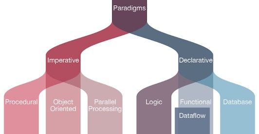

# 프로그래밍 패러다임

2019.02.22



## Imperative VS Declarative

|          | Imperative - 명령형 | Declarative - 선언형 |
| :------: | :-----------------: | :------------------: |
|   목표   |    명시하지 않음    |        명시함        |
| 알고리즘 |       명시함        |    명시하지 않음     |

### 명령형 프로그래밍

- 프로그램은 명령의 수행이라고 생각함
- 명령 수행의 과정(HOW TO) 에 초점을 맞춤
- 단계별로 할 일에 FOCUS

```js
// 명령형 프로그래밍 예시: Array 내 모든 값에 2씩 곱해주는 함수 작성
function double(arr) {
  let results = [];
  for (let i = 0; i < arr.length; i++) {
    results.push(arr[i] * 2);
  }
  return results;
}
```

### 선언형 프로그래밍

- 무엇을 할 것인가 명시함(WHAT)
- 목표에 FOCUS
- HTML, SQL 등

```js
// 선언형 프로그래밍 예시: Array 내 모든 값에 2씩 곱해주는 함수 작성
function double(arr) {
  return arr.map((item) => item * 2);
}
```

```html
<!-- 선언형 프로그래밍 예시: Hello World 출력 -->
<h1>Hello World!</h1>
```

## Procedural / Object-Oriented / functional

- 최근 많은 언어들이 위 3가지 타입을 모두 가지고 있음

### 초기 프로그래밍

- 입력을 받아 명시된 순서대로 처리한 후 결과 출력
  

- 시간이 지나면서 규모가 큰 프로그램을 감당할 수 없게 됨

### Procedural Programming

- 절차적 프로그래밍
  - 번역이 아쉬운 예 1: 여기서 Procedural 은 프로시저, 즉 **함수**를 뜻함
- **함수의 추상화와 재사용성의 시작**

  - 코드의 재활용성이 높아짐

- 추상화: 복잡한 자료, 모듈, 시스템 등으로부터 핵심적인 부분을 간추려 내는 것
  - 인간만의 고유한 특징: 상징 체계를 만들고 공유하는 능력
    - 언어, 음악, 수학 등
  - 다시 이야기하자면, 추상화는 대상으로부터 특징만을 뽑아낸 것

### Object-Oriented Programming

- 객체 지향 프로그래밍

  - 번역이 아쉬운 예 2: Oriented 는 지향 보다 **위주** 라는 말이 어울림

- 클래스(Class) : 추상화 작업 / 설계도
- 객체(Object) : 클래스의 실체
- 3가지 요소

  - 캡슐화(Encapsulation)

    - 데이터와 그 데이터에 대한 조작을 같이 묶음

      - 클래스내에 인스턴스와 메소드를 같이 넣어둠

      ```js
      // 클래스 예시
      class Rectangle {
        // 데이터 부분
        constructor(height, width) {
          this.height = height;
          this.width = width;
        }
        // Getter
        get area() {
          return this.calcArea();
        }
        // 데이터 조작 부분
        // Method
        calcArea() {
          return this.height * this.width;
        }
      }

      const square = new Rectangle(10, 10);

      console.log(square.area); // 100
      ```

  - 상속성(Inheritance)
    - 클래스를 상속할 수 있어야 함
    - 재사용성 & 유용성 확보
  - 다향성(Polymorphism)
    - "여러 형태" 라는 뜻의 그리스어
    - 같은 함수를 다른 Object 에서 사용 가능
      - 다른 Object 가 같은 클래스에서 만들어 진 것이라면 가능함

- 디자인 패턴
  - 객체 지향 프로그래밍 설계를 할때 자주 발생하는 문제들을 피하기 위해 사용되는 패턴

### Functional Programming

- 함수형 프로그래밍
- 람다 계산법에 기반함

- 4가지 특징

  - 1급 객체: 아래 조건을 만족
    - 변수나 데이터 구조 안에 담을 수 있다.
    - 파라미터로 전달 할 수 있다.
    - 반환값으로 사용할 수 있다.
  - 고차 함수(High-Order Function)
    - 함수에 함수를 파라미터로 전달할 수 있다.
    - 함수의 반환값으로 함수를 사용할 수 있다
    - Ex) js: map / reduce
  - 불변성(Immutable)
    - 데이터가 변하면 안된다
    - 변수 X, 상수만 존재
  - 순수 함수(Pure Function)

    - Side-effect 가 없는 함수
    - 함수의 실행이 외부에 영향을 끼치지 않는 함수

      - return 으로 값을 넘겨줌

      ```js
      // 순수함수와 불변성이 깨진 예
      let arr = ['aa', 'bb'];

      function impureFunc(name) {
        arr.push(name);
      }
      impureFunc('cc'); // 결과 : ["aa","bb","cc"]
      ```

## 출처 및 참고자료

- [객체지향 개념 (쫌 아는체 하기)](https://www.slideshare.net/plusjune/ss-46109239)
- [객체지향 프로그래밍에 대한 오해와 진실](http://beyond.daesan.com/articles/2006/08/16/misunderstanding-and-truth-about-oop)
- [객체지향 프로그래밍에 대한 오해와 진실 - 2](http://beyond.daesan.com/articles/2006/08/17/misunderstanding-and-truth-about-oop-2)
- [함수형 프로그래밍 요약](https://velog.io/@kyusung/%ED%95%A8%EC%88%98%ED%98%95-%ED%94%84%EB%A1%9C%EA%B7%B8%EB%9E%98%EB%B0%8D-%EC%9A%94%EC%95%BD)
- [왕초보를 위한 <Reactive programming이 뭔지 알기 전에>](https://zeddios.tistory.com/303)
- [프로그래밍 패러다임과 파이썬](https://tech.peoplefund.co.kr/2018/11/28/programming-paradigm-and-python-kor.html)
- [Software Engineering Fundamentals — Programming Language Concepts](https://blog.k2datascience.com/software-engineering-fundamentals-programming-language-concepts-921e00dcbe28)
- [Frontend Developers: 번역문서 - 함수형 프로그래밍](https://github.com/FEDevelopers/tech.description/wiki/%EB%B2%88%EC%97%AD-%EB%AC%B8%EC%84%9C)
